# SaaS de Agendamento


Sistema de agendamento voltado para profissionais e empresas que precisam gerenciar serviços e compromissos de forma prática e automatizada.  
⚠️ **Projeto em desenvolvimento**

---

## Funcionalidades

- Cadastro e gerenciamento de clientes
- Agendamento de serviços
- Dashboard com visão geral de compromissos
- Notificações e lembretes
- Configurações personalizadas para cada empresa
- Relatórios e histórico de atendimentos

> Algumas funcionalidades ainda não estão implementadas.

---

## Tecnologias

- **Frontend:** React, Tailwind CSS, JavaScript
- **Backend:** Java Spring Boot
- **Banco de dados:** MySQL
- **Controle de versão:** Git

---

## Estrutura do Projeto

```
/frontend
  /site-empresa      -> Interface do dashboard do empresário
  /site-cliente      -> Interface para clientes agendarem serviços
  /site-admin        -> Interface administrativa geral
/backend             -> APIs e lógica de negócio, conecta sites e banco de dados
/docs                -> Documentação da API (Swagger)
/screenshots         -> Capturas de tela do frontend
```

---

## Prints

> Estado atual do frontend:


>/site-empresa 

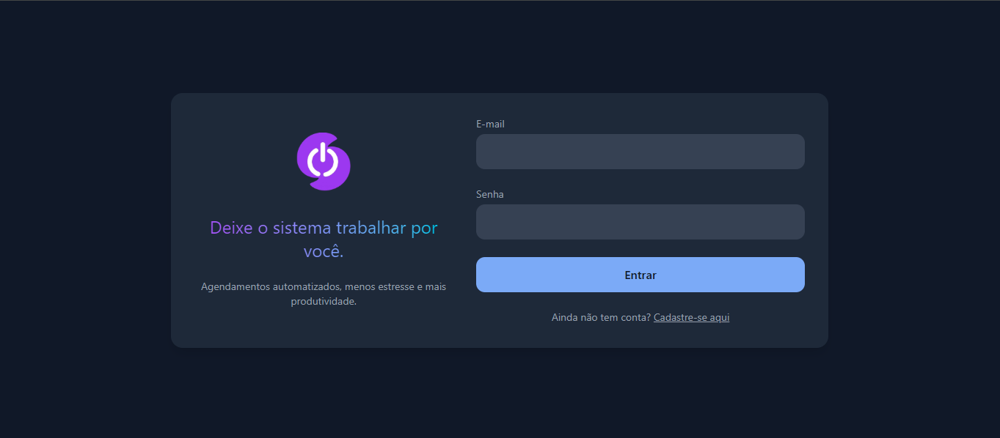
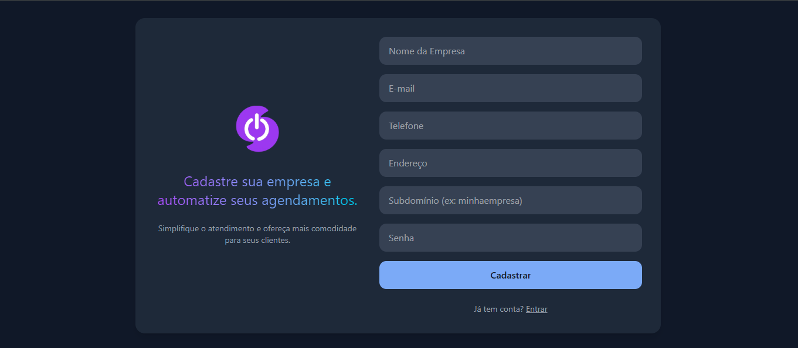
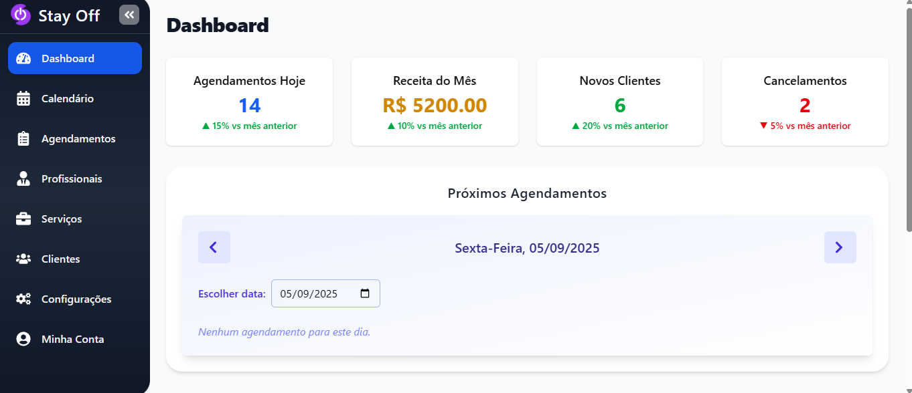
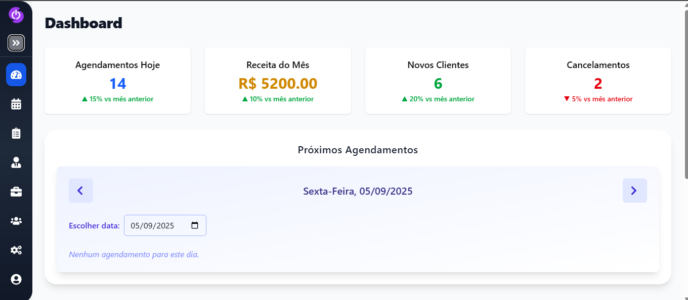

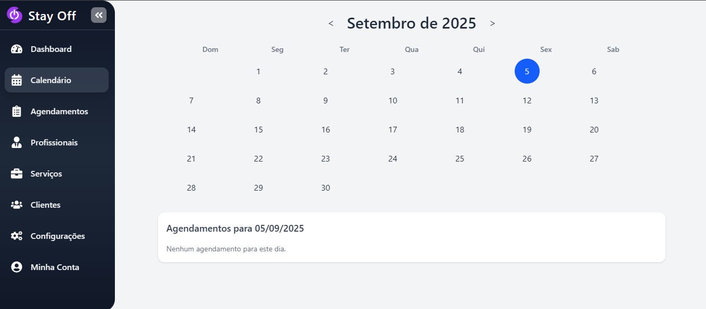
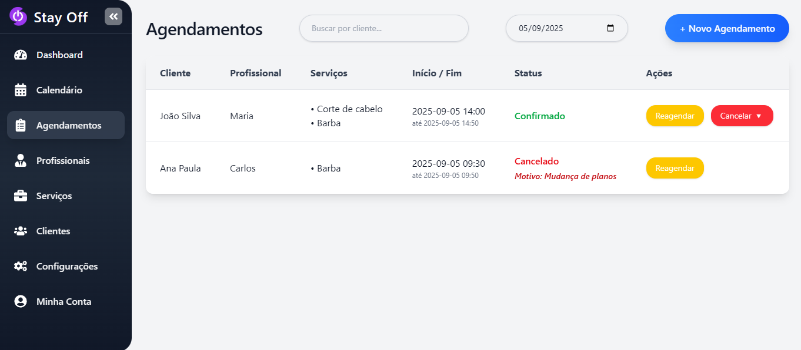
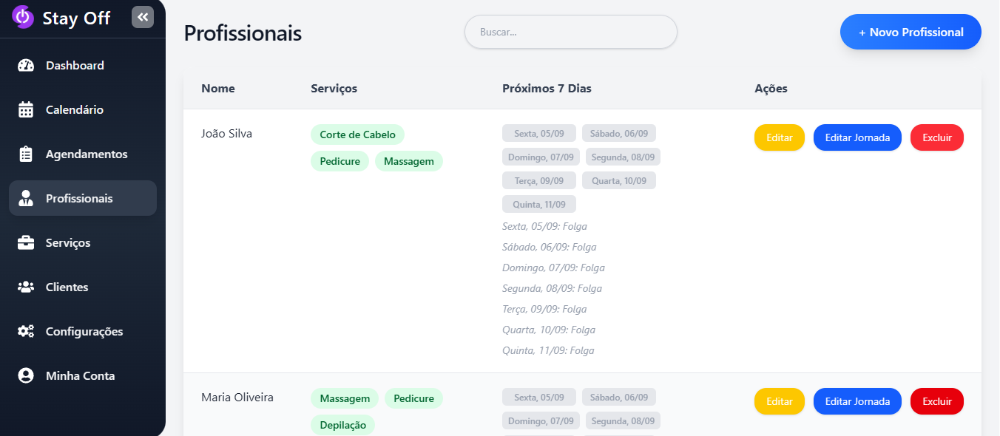
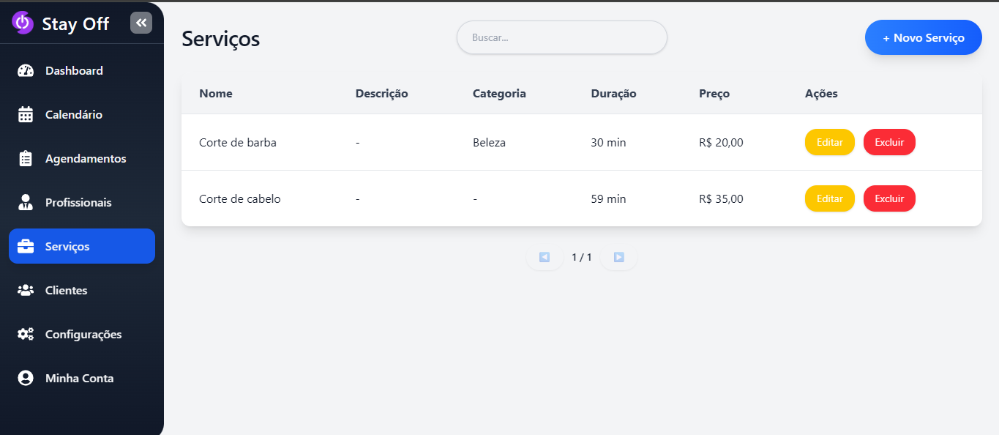
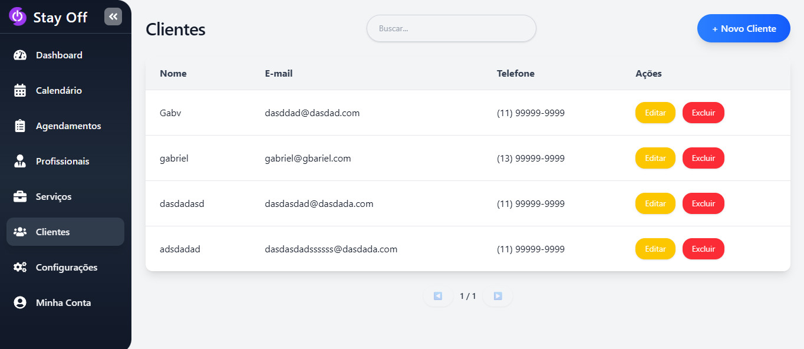
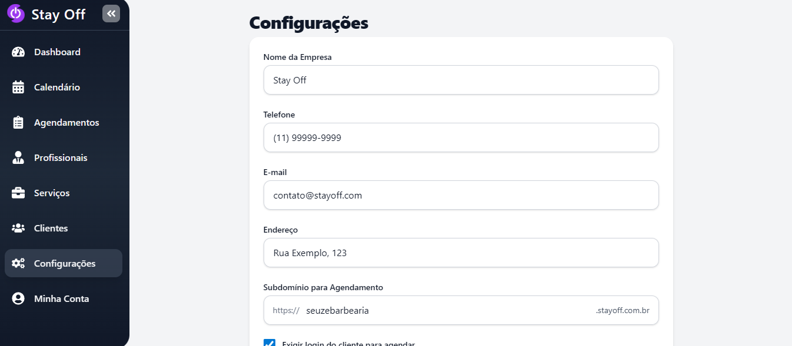
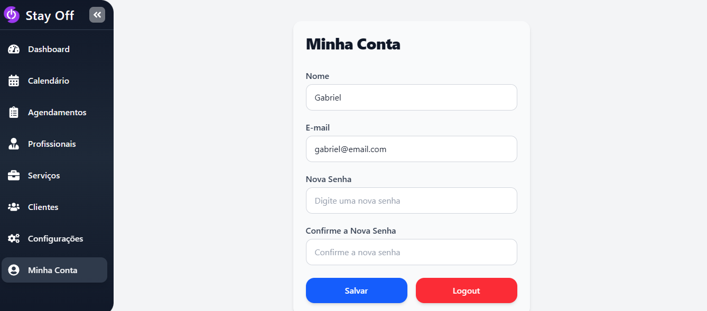

---

## Status do Projeto

O projeto está em **fase de criação** e ainda não possui instruções de execução. Funcionalidades e integrações estão sendo desenvolvidas.

---

## Contato

- Gabriel Da Costa Alves – Desenvolvedor Principal
- Email: `alvesgabrieldacosta@gmail.com`
